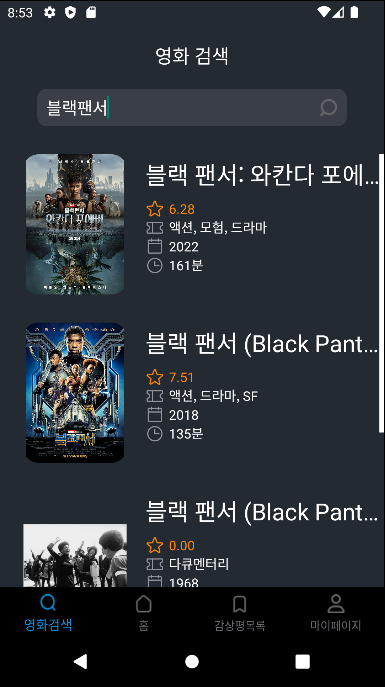
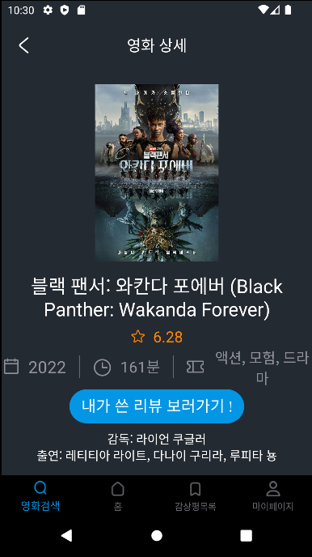

MVTI 🎬
===========================================
> MBTI 기반 영화 추천 및 영화 감상 기록 어플  

  

## Overview
1. [프로젝트 목표](https://github.com/ohyyes/movieApp/blob/main/README.md#1-%ED%94%84%EB%A1%9C%EC%A0%9D%ED%8A%B8-%EB%AA%A9%ED%91%9C)
2. [앱 소개](https://github.com/ohyyes/movieApp/blob/main/README.md#2-%EC%95%B1-%EC%86%8C%EA%B0%9C)
3. [기능 구현](https://github.com/ohyyes/movieApp/blob/main/README.md#3-%EA%B8%B0%EB%8A%A5-%EA%B5%AC%ED%98%84)
4. [문제 해결](https://github.com/ohyyes/movieApp/blob/main/README.md#4-%EB%AC%B8%EC%A0%9C-%ED%95%B4%EA%B2%B0)
5. [팀원](https://github.com/ohyyes/movieApp/blob/main/README.md#5-%ED%8C%80%EC%9B%90)

  

## 1. 프로젝트 목표
* 일별 박스오피스 및 영화 검색  
* 나의 성격 유형-MBTI 에 맞는 영화 추천  
* 본 영화에 대한 내 생각과 느낌을 그때그때 기록  
* 내가 본 영화들과 그에 대한 나의 감상평을 한눈에
#### 이러한 기능을 갖춘 어플을 만들어 직접 사용하자!
#### 깃과 여러 협업툴 사용법 숙지 등 협업 능력 향상
#### 모바일 프로그래밍 경험이 없는 팀원들로 구성 -> 전반적인 프로그래밍 경험 쌓기

  

## 2. 앱 소개 
### 기본 정보
* 실행 환경: 모바일 어플리케이션 (안드로이드)
* 개발 환경: 안드로이드 스튜디오 SDK 12 ??
* 사용 언어: JAVA

  

### 주요 화면 및 기능
#### 1) 홈 화면 - 박스오피스, MBTI 기반 영화 추천

박스오피스 - 상단의 일별 박스오피스는 현재 상영 중인 영화들을 일간 관객수 기준으로 1위부터 5위까지 순서대로 보여준다.     
MBTI 기반 영화 추천 - 하단에는 사용자의 mbti를 기반으로 20개의 추천 영화를 보여준다.

#### 2) 영화 검색 및 상세 화면

영화 검색 - 상단의 검색창에 검색어를 입력해 돋보기 버튼을 누르면 영화 제목에 해당 keyword를 포함하는 영화들을 검색한다. 
영화 포스터, 평점, 장르, 개봉일 등의 정보를 확인해 원하던 영화를 찾아 클릭하시면 해당 영화 상세 페이지로 이동한다.
 
영화 상세 - 줄거리, 감독, 출연 배우 등 더 상세한 정보를 볼 수 있다. 중앙의 [내가 쓴 리뷰 보러가기 !] 버튼을 클릭해 이전에 그 영화로 작성한 감상평이 있었다면 저장된 해당 영화의 감상평 상세 페이지로 이동, 없었다면, “작성한 감상평이 없네요!” 메세지를 띄운 팝업창이 뜨고 [작성하기] 버튼을 눌러 감상평을 작성하는 페이지로 이동한다.
영화 상세 페이지에서는 파이어베이스와 연동하여 사용자가 리뷰를 작성하였는지 먼저 확인합니다. 사용자가 작성했을 경우, 평점과 글을 파이어베이스에서 받아 setText로 넘겨주고 작성하지 않았을 경우 값을 넘겨주지 않도록 설정해두었습니다.

#### 3) 감상평 목록 및 상세 화면

사용자가 작성한 감상평들을 보여준다. 영화 포스터 이미지, 제목, 내 평점, 개봉연도, 내가 작성한 감상평 일부분을 확인할 수 있다. 감상평을 클릭하면 해당 감상평 상세 페이지로 이동한다. 
감상평 상세 페이지에서는 해당 영화에 대한 평점과 감상평을 남길 수 있다. 기존 감상평이 없었다면 작성하는 창
중앙의 별버튼을 눌러

#### 4) 마이페이지 - 정보 수정, 감상평 목록

사용자의 닉네임과 MBTI 정보를 보여준다. [내 프로필 수정하기] 버튼을 누르면 닉네임과 MBTI를 수정할 수 있는 페이지로 이동한다.
마이페이지의 하단 오른쪽의 [더보기] 버튼을 누르면 사용자가 작성한 전체 감상평 목록으로 이동한다.
마이페이지의 하단에는 사용자가 감상평을 작성한 영화들을 좌우로 스크롤하며 볼 수 있다. 원하는 영화를 클릭하면, 해당 영화로 작성한 감상평 상세 페이지로 이동한다.

  

## 3. 기능 구현

1) 스플래쉬 화면
front
어플을 처음 실행했을 때 스플래쉬를 통해 애니메이션을 추가.

2) 회원가입 화면
front
로그인 화면과 비슷하게 각 입력값과 MBTI 토글을 하나라도 입력하지 않으면 버튼이 눌리지 않게 구현. 모든 입력값이 있다면 버튼이 활성화된 이미지로 변경된다. 비밀번호는  toggle을 설정하여 비밀번호가 안보이는 것을 기본값으로 구현했다.
back

3) 로그인 화면
front
로그인 화면은 이메일과 비밀번호 입력받는 가능과 입력값 유무에 따라 에러메세지를 Toast로 표시한다. 비밀번호는 회원가입과 마찬가지로 toggle을 설정하여 비밀번호가 안보이는 것을 기본값으로 구현했습니다.
back

4) 홈화면
front
홈화면에서는 네비게이션 바를 이용해 프래그먼트 전환할 수 있다. 홈화면의 주요 기능은 실시간 박스오피스 영화와 유저 mbti를 기반으로 추천되는 영화를 표시하는 것이다. 이 부분은 recyclerview로 구현했습니다. 
back
네이버에서 “박스오피스”라고 검색했을 때 나오는 페이지에서 1위부터 5위까지의 영화 정보(제목, 포스터)를 Jsoup 라이브러리를 이용해 가져와 UI에 띄울 수 있도록 fragment와 연결한다.
추천 영화는 임의로 인기 있는 영화 목록 데이터를 데이터베이스에 저장해두고 각 영화마다 16개의  MBTI 중 하나를 매칭하여 사용자의 MBTI 유형에서 과 4개 항목 중 3개 이상 겹치는 영화들을 20개

5) 영화 검색 페이지 (fragment)
front
영화 검색 페이지의 구성은 다음과 같습니다. 상단에는 검색어 입력창과 중앙에는 리사이클러뷰로 구성이 되어있습니다. 영화 검색 결과는 백엔드의 권해담님이 api를 이용해 추린 결과를 리사이클러뷰의 아이템 형식으로 나오도록 했습니다. 검색을 했을 때, 검색 결과가 있다면, 그 결과를 수직 리사이클러뷰로 보여주고, 없을 때는 해당 검색 결과가 없다는 레이아웃을 보여줍니다. 리사이클러뷰의 각 아이템을 클릭하면, 클릭된 현재 아이템의 데이터를 영화 상세페이지 프래그먼트에 전달하면서 화면전환하도록 구현했습니다. 
back

 
6) 영화 상세 페이지
front
중앙 콘텐트는 스크롤뷰로 구성을 했고, [내가 쓴 리뷰 보러가기] 버튼을 눌렀을 때, 가져올 감상평 데이터가 있는지 확인합니다. 감상평이 있다면 해당 영화로 작성된 감상평 상세페이지 프래그먼트로 이동하고, 없다면, 감상평이 없다는 팝업창에 [작성하기] 버튼으로 감상평 상세페이지 프래그먼트로 이동하도록 구현했습니다.
back
 
7) 감상평 목록 페이지 
front
감상평 목록화면은 유저가 작성한 감상평을 보여주는 화면입니다. 이 부분도 라시이클러뷰로 구현을 했는데 감상평 데이터가 없을 때에는 두번째 화면처럼 감상평이 없다는 것을 알려줍니다. 이외에도 편집 버튼을 통해 다중선택과 삭제룰 할 수 있고 spinner 위젯으로 각 기준이 따른 정렬도 가능하도록 하였습니다.
back
 
8) 감상평 상세 페이지
front
감상평 상세 페이지에서는 데이터 유무로 표시되는 화면이 다릅니다. 데이터가 있다면 감상평 수정을 할 수 있고 데이터가 없다면 오른쪽 화면을 보여주며 별점을 선택하고 내용을 등록하는 기능을 담았습니다.
 back

9) 마이페이지
front
마이페이지의 상단에는 회원정보를 TextView로 보이게했고, 중앙에는 [프로필 수정하기] 버튼이, 하단에는 내가 작성한 감상평 목록을 리사이클러뷰로 보여줍니다. [프로필 수정하기] 버튼을 누르면 프로필 수정 페이지로 이동합니다. 마이페이지의 하단에는 수평 리사이클러뷰를 사용해서 내 감상평 목록들을 포스터 형식으로 보이게 구현했습니다. 앞전에 소개한 영화 검색페이지와 비슷하게 기존에 작성한 감상평이 있을때만 리사이클러뷰를 보이게 설정했습니다. 각 아이템을 클릭하면 해당 감상평 상세 페이지로 이동합니다. 
back

10) 프로필 수정 페이지
front
기존 회원 정보 중 닉네임과 MBTI를 불러오고 사용자가 수정할 때는 닉네임 EditText에 입력값이 있는 경우에만 [완료] 버튼이 활성화 되도록 만들었습니다. [완료] 버튼을 누르면 저장한 후, 마이페이지로 다시 돌아옵니다.
back

  

## 4. 문제 해결

  

## 5. 팀원
##### 팀장: 송규원
##### 프론트: 김혜은, 박수연
##### 백: 권해담, 송규원, 유다영
